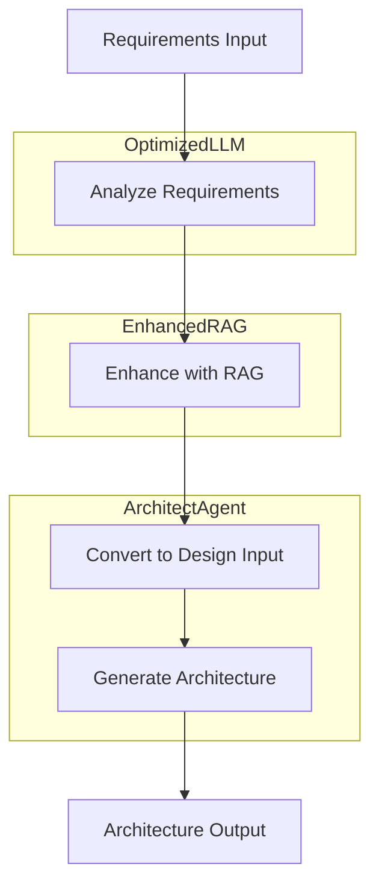
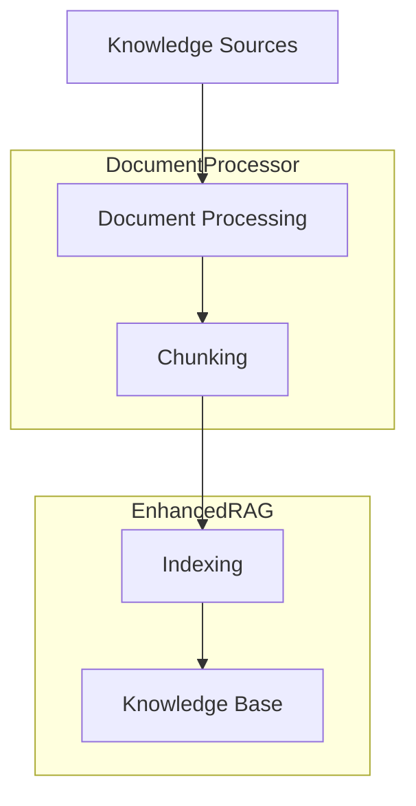
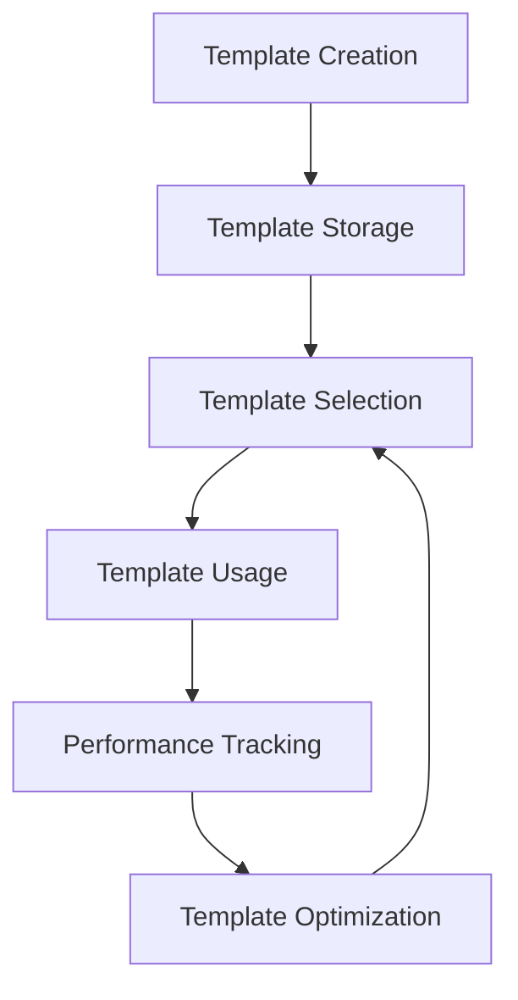

# Domain-SC System Workflows

## Table of Contents
1. [System Architecture Overview](#system-architecture-overview)
2. [Core Components](#core-components)
3. [Primary Workflows](#primary-workflows)
4. [Data Flows](#data-flows)
5. [Secondary Workflows](#secondary-workflows)
6. [Integration Points](#integration-points)
7. [Error Handling](#error-handling)
8. [Extension Points](#extension-points)

## System Architecture Overview

Domain-SC is an AI-driven system architecture design platform that uses advanced LLM techniques, Retrieval-Augmented Generation (RAG), and simulation-based approaches to generate high-quality system architectures from natural language requirements.

The system follows a layered architecture with four main layers:

1. **Service Layer**: Provides core capabilities (LLM, RAG, etc.)
2. **Agent Layer**: Domain-specific intelligent agents that perform specialized tasks
3. **Workflow Layer**: Orchestrates the interaction between agents and services
4. **Interface Layer**: Exposes the system's functionality to users


## Core Components

### Services

1. **OptimizedLLMService**
   - Provides intelligent access to language models
   - Implements cost-efficiency through smart model selection
   - Features semantic caching for similar requests
   - Tracks usage and costs

2. **EnhancedRAGService** 
   - Provides knowledge retrieval capabilities
   - Implements semantic pre-evaluation to filter irrelevant documents
   - Manages document indexing and retrieval
   - Optimizes token usage with lightweight evaluations

3. **AdaptivePromptSystem**
   - Manages prompt templates
   - Tracks template performance
   - Selects optimal templates based on historical performance
   - Supports versioning and A/B testing of prompts

### Agents

1. **EnhancedSystemArchitectAgent**
   - Designs architecture based on requirements and constraints
   - Uses simulation to predict outcomes before execution
   - Implements self-correction when deviations are detected
   - Produces structured architecture designs with components, interfaces, and data flows

2. **Other Supporting Agents**
   - Requirements Analysis Agent
   - Technology Agent
   - Optimization Agent
   - Orchestrator Agent

## Primary Workflows

### 1. Architecture Generation Workflow



**Steps:**
1. User inputs natural language requirements
2. System analyzes and structures the requirements
3. RAG enhances requirements with relevant architectural knowledge
4. Requirements are formatted for the architecture agent
5. Simulation-based architecture generation occurs
6. Final architecture is produced and presented to the user

### 2. Knowledge Ingestion Workflow



**Steps:**
1. System ingests knowledge from various sources (markdown, PDF, etc.)
2. Documents are processed and text is extracted
3. Text is chunked into appropriate sizes
4. Chunks are indexed with embeddings
5. Knowledge is available for RAG retrieval

### 3. Template Management Workflow



**Steps:**
1. Templates are created for various agent functions
2. Templates are stored in the adaptive prompt system
3. System selects appropriate templates based on task
4. Templates are used to generate prompts
5. Performance of templates is tracked
6. Templates are improved based on performance data

## Data Flows

### 1. Knowledge Flow

```
Document Sources → Document Processor → Vector Store → RAG Service → Relevant Knowledge → Agent
```

Knowledge flows from external sources through processing and indexing into the vector store, where it can be retrieved by the RAG service to provide relevant context to agents.

### 2. Prompt Flow

```
Task → Adaptive Prompt System → Template Selection → Templating Engine → Formatted Prompt → LLM Service → Response
```

Tasks require prompts, which are managed by the adaptive prompt system that selects appropriate templates, formats them with inputs, and sends them to the LLM service for processing.

### 3. Architecture Data Flow

```
Requirements → Structure → Context Enhancement → Design Input → Simulation → Component Generation → Interface Design → Data Flow Mapping → Architecture Synthesis → Final Architecture
```

Requirements data is transformed through multiple stages, from initial structuring to final architecture, with various enhancement and validation steps along the way.

## Secondary Workflows

### 1. Cost Optimization Workflow

The system continuously optimizes cost by:
1. Tracking token usage across services
2. Selecting appropriate models based on task complexity
3. Caching semantically similar queries
4. Pre-filtering documents before full processing
5. Using simulation to reduce rework

### 2. Quality Improvement Workflow

Quality is continually improved through:
1. Performance tracking of templates
2. Simulation-based validation
3. Self-correction when deviations are detected
4. Feedback loops for template selection
5. Continuous enhancement of the knowledge base

## Integration Points

### 1. External LLM Provider Integration

The system integrates with external LLM providers (OpenAI, Anthropic, etc.) through:
- Credentials management
- API request formatting
- Error handling and retry logic
- Response parsing and normalization

### 2. Vector Database Integration

The system integrates with vector databases for knowledge storage:
- ChromaDB for embedding storage
- Collection management
- Query construction
- Result processing

### 3. File System Integration

The system integrates with the file system for:
- Document reading
- Template storage
- Output generation
- Configuration management

## Error Handling

### 1. LLM Service Errors

- Connection failures: Automatic retries with exponential backoff
- Invalid responses: Fallback to alternative models
- Token limit exceeded: Automatic chunking and reconstruction
- Cost limits: Graceful degradation to cheaper models

### 2. RAG Service Errors

- Index failures: Fallback to direct prompt
- Relevance scoring errors: Default to distance-based retrieval
- Empty results: Generate without context enhancement
- Vector store connection issues: Cache previous results

### 3. Agent Processing Errors

- Simulation failures: Retry with simplified approach
- Invalid outputs: Self-correction with guided templates
- Timeout issues: Break down into smaller tasks
- Integration errors: Fallback to standalone processing

## Extension Points

### 1. New Agent Types

The system can be extended with new agent types by:
1. Creating new agent classes that inherit from BaseAgent
2. Implementing task-specific logic
3. Creating templates for the agent's prompts
4. Registering with the agent registry

### 2. Additional Knowledge Sources

Support for new knowledge sources can be added by:
1. Implementing document processors for the new format
2. Creating extraction logic for the format
3. Adding chunking strategies appropriate to the format
4. Implementing metadata extraction

### 3. UI Integration

The system is designed for UI integration through:
1. Well-defined API endpoints
2. Structured JSON responses
3. Progress tracking capabilities
4. Asynchronous processing support